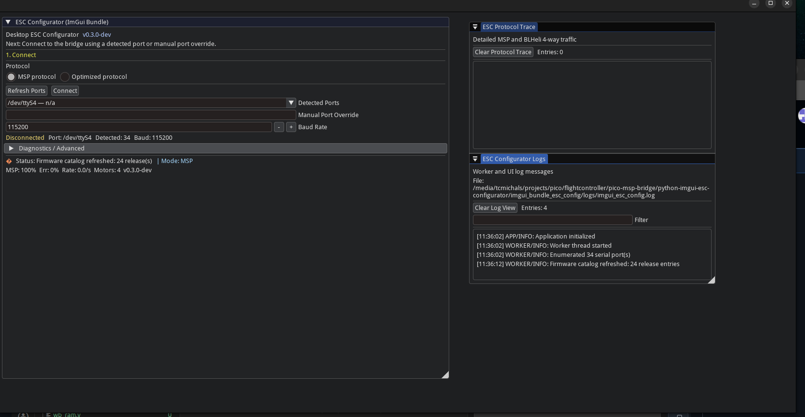

# Python ESC Configurator

This repository is the **desktop Python ESC configurator**.

It is the **full-featured ESC configurator target** for this project — not a stripped-down demo, not a temporary helper tool.

## What it does

- ESC passthrough
- ESC discovery
- settings read/write
- firmware catalog/download
- firmware flash/verify workflows
- diagnostics, logs, and protocol traces

## Protocol status

- **MSP is fully supported today** and remains the complete compatibility path.
- **FCSP** is the new protocol path being added for the next-generation offloader architecture.
- The GUI should remain stable while transport/protocol details evolve underneath the worker layer.

In short:

- **today:** fully featured MSP-based ESC configurator
- **next:** same configurator workflows over FCSP where appropriate

## Companion repository

The FPGA/offloader repository is:

- `rt-fc-offloader`

Canonical FCSP spec lives there:

- `rt-fc-offloader/docs/FCSP_PROTOCOL.md`

Do not duplicate the FCSP spec in this repository.

## Screenshot

Current Python ImGui ESC configurator UI:

## Start here

- `REQUIREMENTS.md` — clear repository requirements
- `GITHUB_TODO.md` — active GitHub task list
- `imgui_bundle_esc_config/DESIGN_REQUIREMENTS.md` — detailed application requirements

## Development notes

- Development is Linux-first.
- End-user friendliness should remain strong for Windows users.
- Keep `.venv/` local-only and out of git.

## Scope guardrails

- Keep this repo focused on the Python ESC configurator.
- Keep MSP working while FCSP is introduced.
- Do not push protocol details into the GUI layer unless absolutely necessary.
- Preserve a fully featured user-facing configurator experience.
