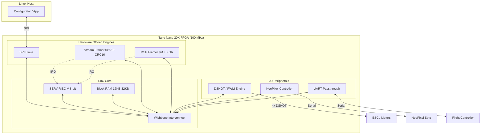

## 1. System Block Diagram

## 2. Interface Specifications

### 2.1 Processing Core
- **SERV RISC-V**: 8-bit parallel mode (`WIDTH=8`).
- **Why?**: Provides ~20-25 MIPS at 100 MHz with minimal LUT usage, allowing plenty of room for multi-channel DSHOT and NeoPixel engines.

### 2.2 Framing Engines (RTL Offload)
- **Stream Framer (0xA5)**:
  - Synchronizes on `0xA5` byte.
  - Generates combinational **CRC16-XMODEM** (Polynomial 0x1021) in a single cycle.
  - Only interrupts the SERV core after a full, valid packet is captured.
- **MSP Framer ($M)**:
  - Synchronizes on `$M` byte.
  - Automatically calculates XOR checksums for high-rate telemetry.

### 2.3 Physical Interfaces
- **Host (SPI Slave)**:
  - Protocol: Mode 0 (CPOL=0, CPHA=0).
  - Clock Speed: Support up to 50 MHz (sampled at 100 MHz).
  - Data Width: 8-bit (aligned to 32-bit Wishbone words).
- **Motors (DSHOT/PWM)**:
  - DSHOT: Supports DSHOT-150/300/600/1200 with DMA-like offload.
  - PWM: Standard 400Hz/490Hz multi-channel output.
- **Telemetry (UART)**:
  - Baudrate: 115200 to 2,000,000 bps.
  - Precision: Fractional baudrate generator in RTL for low jitter.

### 2.4 Internal Bus (Wishbone)
- **Type**: Wishbone B4 (Pipeline mode).
- **Data Width**: 32-bit (Optimal for RISC-V instructions).
- **Address Space**: 
  - `0x0000_0000`: Code/Data RAM.
  - `0x8000_0000`: Peripheral Space (Framer, DSHOT, SPI).

## 3. Software Architecture (Firmware)

### 3.1 Stackless Threading (Protothreads)
To save Block RAM and ensure cycle-accurate performance, we use **Protothreads (`pt.h`)** instead of a full RTOS.
- **Zero Stack Overhead**: All threads share the same stack.
- **Deterministic Switching**: Context switches are implemented as single-jump `switch/case` statements.

### 3.2 Interrupt Strategy
- **Low-Latency ISR**: The Interrupt Service Routine only signals a flag to the relevant Protothread.
- **Background Processing**: The main loop polls active threads, ensuring no "Heavy" logic blocks the real-time SPI path.

## 4. Verification Flow

### 4.1 Real-Time Simulation Bridge
We use **Verilator** to create a C++ model of the FPGA. A custom **`SimBridge`** class creates:
- **PTY (/dev/pts/X)**: A virtual serial port for the Python host.
- **TCP (localhost:4445)**: A network port for automated CI/Testing.

This allows the **REAL Python Configurator** to talk to the **REAL RTL logic** in real-time before any hardware is touched.
