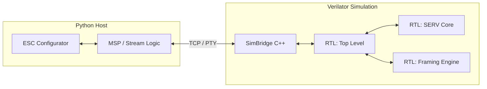

# Simulation Bridge: Python <=> Verilator

This document describes the high-performance simulation architecture used in Phase B to bridge the **Python ESC Configurator** and the **Tang Nano 20K FPGA** logic.

## Architecture

Our "Better/Faster" testing flow uses **Verilator** to convert Verilog RTL into a high-speed C++ model, which is then wrapped in a socket-enabled testbench.



## Connection Methods

The simulation bridge provides two ways for the Python host to "talk" to the simulated hardware:

### 1. Pseudo-Terminal (PTY) — Recommended for Testing
The simulation automatically creates a virtual serial port (e.g., `/dev/pts/6`). Your Python code can attach to this exactly like a real USB-Serial port.

- **Verilator Output**: `[SimBridge] PTY: /dev/pts/X`
- **Python Connect**: `python configurator --port /dev/pts/X`

### 2. TCP Socket — Recommended for Automated CI
The simulation listens on a network port. This is useful for automated testing where you want to avoid OS-level device permissions.

- **Verilator Output**: `[SimBridge] TCP: localhost:4445`
- **Python Connect**: `python configurator --port socket://localhost:4445`

## Running a Test Session

1.  **Start the Simulation**:
    ```bash
    cmake --build build_sim --target sim_stream_framer
    ```
    Keep this terminal open. It will show real-time RTL events (e.g., `VALID Packet Detected`).

2.  **Connect the Configurator**:
    In a new terminal:
    ```bash
    python3 python/imgui_bundle_esc_config/main.py --port /dev/pts/X
    ```

3.  **Verify**:
    Any MSP command sent by the UI will be processed by the **Hardware Framing Engine** in the simulation. If the CRC matches, you will see a success message in the Verilator console.

## Performance
- **Sim Speed**: ~1-2 MHz (simulated clock) on a modern CPU.
- **Offload**: 100% of the CRC/Checksum logic is handled by the RTL, so the simulated CPU (SERV) only wakes up for valid frames.
