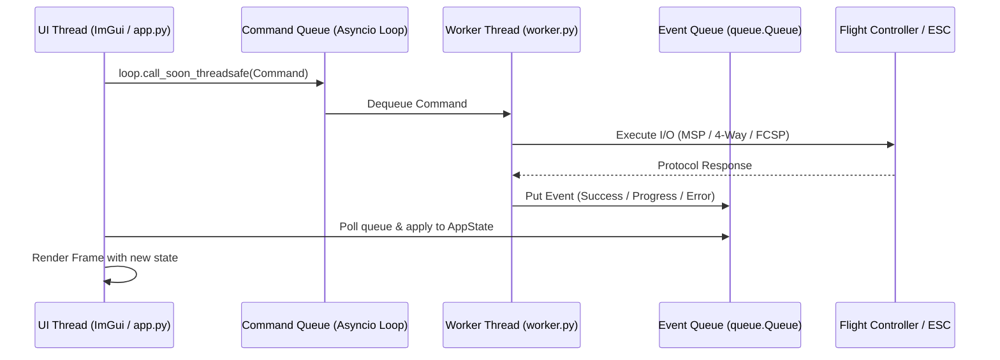

# ImGui Bundle ESC Configurator — Design, Requirements, and Feature Specification

## Goal

`python/imgui_bundle_esc_config` is intended to become a **full desktop replacement** for the existing web application at:

- `https://esc-configurator.com/`

The replacement should preserve the major workflow and capabilities users expect from `esc-configurator`, while adapting the implementation to a Python desktop application built with `imgui-bundle`.

This project also has an explicit **classroom/reference** goal:

- it should help users understand how the tool works
- it should help programmers and engineers learn how to structure non-blocking GUI + backend systems
- it should give AI coding agents a concrete repository-level standard for how this codebase wants GUI, worker, protocol, testing, and diagnostics concerns separated

## AI usage intent

This document is also intended to be used as **prompt context for AI coding agents**.

When used in prompts, this file should be treated as:

- the product definition
- the feature parity target
- the architecture guide
- the implementation constraint list

When an AI agent uses this document, it should prefer the requirements here over inventing alternate workflows unless the user explicitly asks for a deviation.

Additional policy intent:

- this repository should teach the preferred standard, not merely contain working code
- when there are multiple reasonable implementation choices, prefer the one that best demonstrates reusable architecture, testability, and observability

## Canonical terminology

To reduce ambiguity in future prompts, use these terms consistently:

- **bridge**: this repository's firmware/device that exposes MSP and ESC passthrough behavior
- **web reference app**: `https://esc-configurator.com/`
- **desktop replacement**: the Python `imgui-bundle` application in `python/imgui_bundle_esc_config`
- **worker thread**: the non-UI thread that owns serial/MSP/4-way communication
- **UI thread**: the thread that owns all ImGui calls and rendering
- **ESC family**: firmware family such as BLHeli_S or Bluejay
- **firmware catalog**: remote metadata and downloadable firmware images
- **settings**: EEPROM-derived configuration values displayed and edited in the UI

## Replacement scope

This is **not** a minimal demo and **not** a partial utility.
The target is a practical operator-facing application that can replace the current web workflow for supported ESC families.

The app must support:

- ESC discovery and connection through the local bridge / serial transport
- MSP-based passthrough activation
- BLHeli 4-way protocol transactions
- EEPROM/settings read and write
- Firmware flashing workflow
- Progress, status, validation, and error reporting
- Multi-ESC workflows
- Firmware catalog download and local firmware file loading

## Supported firmware families

The initial replacement must support at minimum:

- **BLHeli_S**
- **Bluejay**

The design should keep room for future expansion, but parity priority is:

1. BLHeli_S
2. Bluejay

## Reference sources

### Local parity reference

Primary behavior reference:

- `https://esc-configurator.com/`

This source should be treated as the reference for:

- workflow sequencing
- feature coverage
- firmware selection behavior
- flashing UX
- multi-ESC handling
- error and retry expectations

Supplementary source-code reference during implementation/debugging:

- Local checked-out source (when available): a local clone of `https://github.com/stylesuxx/esc-configurator`
- Upstream source repository: `https://github.com/stylesuxx/esc-configurator`

### Upstream ESC firmware/source references

Use these when parity or compatibility work requires inspecting firmware-family internals rather than only the configurator UI flow.

#### BLHeli / BLHeli_S

- BLHeli upstream repository: `https://github.com/bitdump/BLHeli`
- BLHeli_S SiLabs source tree: `https://github.com/bitdump/BLHeli/tree/main/BLHeli_S%20SiLabs`
- BLHeli_S main source file: `https://github.com/bitdump/BLHeli/blob/main/BLHeli_S%20SiLabs/BLHeli_S.asm`
- BLHeli_S bootloader source: `https://github.com/bitdump/BLHeli/blob/main/BLHeli_S%20SiLabs/BLHeliBootLoad.inc`

#### Bluejay

- Bluejay upstream repository: `https://github.com/bird-sanctuary/bluejay`
- Bluejay main source file: `https://github.com/bird-sanctuary/bluejay/blob/main/src/Bluejay.asm`
- Bluejay DShot / telemetry implementation: `https://github.com/bird-sanctuary/bluejay/blob/main/src/Modules/DShot.asm`
- Bluejay DShot decode / ISR flow: `https://github.com/bird-sanctuary/bluejay/blob/main/src/Modules/Isrs.asm`
- Extended DShot telemetry reference: `https://github.com/bird-sanctuary/extended-dshot-telemetry`

Interpretation note:

- MSP and BLHeli 4-way passthrough behavior lives on the configurator / flight-controller / bridge side.
- Bluejay firmware itself is primarily relevant here for DShot command handling, bidirectional telemetry, extended telemetry, layout details, and EEPROM/firmware-family behavior.

### Local firmware/bridge reference

Bridge behavior and protocol capabilities in this repository:

- `src/msp.cpp`
- `src/msp.h`
- `src/esc_4way.cpp`
- `src/esc_4way.h`
- `src/esc_passthrough.cpp`
- `src/esc_passthrough.h`
- `src/spi_slave.cpp`
- `src/spi_slave.h`

These files indicate the bridge currently supports key 4-way operations such as:

- passthrough start/stop
- interface reset
- flash init
- flash read/write/verify operations
- EEPROM read/write
- multi-motor passthrough selection

## AI implementation constraints

Any AI agent implementing this project should follow these constraints:

- do not collapse the design into a single-threaded blocking UI unless explicitly requested
- do not let the worker thread call ImGui APIs directly
- do not let the UI thread own the live serial port
- do not assume only one ESC exists; design for multi-ESC workflows
- do not implement firmware flashing without compatibility checks and confirmation steps
- do not remove support for local firmware file loading in favor of web-only download flow
- do not hardcode BLHeli_S-only assumptions; Bluejay must be treated as a first-class target
- do not replace message queues with ad-hoc shared mutable state unless there is a strong reason
- prefer explicit models for commands, events, ESC metadata, settings, and firmware images
- preserve enough logging and diagnostics for field debugging
- treat native Python desktop transport/control as the primary delivery path; webapp TCP-bridge compatibility layers are optional future integration work and should not block core replacement milestones
- do not entangle worker logic with ImGui-only state; preserve worker reuse for pytest modules, command-line tooling, alternate frontends, and offloader bring-up utilities

## Implementation priorities for AI agents

If an AI agent is implementing this incrementally, preferred order is:

1. transport and worker skeleton
2. MSP passthrough control
3. 4-way read path
4. ESC discovery and metadata models
5. EEPROM/settings parse and write path
6. UI panels for connect, list, details, logs
7. firmware catalog download and cache
8. flashing and verify workflow
9. persistence and polish

These priorities describe the preferred execution order, but they do **not** reduce the product scope. Incremental work should still be treated as progress toward a full replacement, not as a justification for turning the project into a reduced-scope utility.

## High-level architecture

The desktop application operates on a **two-thread design** with a strict separation of concerns:



### Thread 1: ImGui/UI thread
* **Core Files**: `app.py`, `ui_main.py`, `app_state.py`
* **Responsibilities**:
  - Render windows and widgets via Dear ImGui
  - Process user input and manage local view state
  - Enqueue command requests safely into the worker's command loop
  - Consume worker events and update visible state in `AppState`
* **Constraint**: The UI thread **never** accesses the serial port directly or blocks on network/file calls. It is the **only** thread allowed to make ImGui API calls.

### Thread 2: command/protocol worker thread
* **Core File**: `worker.py`
* **Responsibilities**:
  - Own the serial port / transport session
  - Execute MSP requests, FCSP streams, and 4-way commands
  - Manage timeouts, retries, and transaction cancellation
  - Stream progress, data, logs, and result events back to the UI thread via `Event` queues
* **Constraint**: The worker thread **never** calls ImGui APIs directly. It communicates results entirely through events. The worker/backend layer remains usable outside the ImGui runtime (e.g. for pytest modules, command-line tools, or alternate frontends).

### Inter-thread communication
Use message passing rather than ad-hoc shared mutable state:
* **Command queue (UI → worker)**: UI actions trigger commands (e.g., `CommandReadSettings`).
  - **Requirement**: Use `loop.call_soon_threadsafe` when submitting commands from the ImGui thread to the `asyncio` worker loop. This ensures that the command queue remains purely internal to the async thread, avoiding shared-memory concurrency bugs.
* **Event queue (worker → UI)**: The worker publishes event objects (e.g., `EventSettingsLoaded`) into a thread-safe `queue.Queue`. On every ImGui frame, the UI thread drains this queue and updates `AppState`.
* **Optional**: A read-only snapshot/status object guarded by a lock if needed for convenience.

### Core Module Index
| File | Subsystem | Responsibility |
| :--- | :--- | :--- |
| [`app.py`](app.py) | Application | Application entry point. Initializes ImGui, starts/stops the background worker thread, handles window configuration, and saves user preferences. |
| [`app_state.py`](app_state.py) | UI State | Holds the single source of truth for the UI. Processes incoming worker events and updates bindings for widgets (e.g., connection status, settings, logs). |
| [`worker.py`](worker.py) | Protocol Engine | The background worker loop. Owns the serial port, manages state transitions (MSP <-> Passthrough), parses command arguments, and manages flashing pipelines. |
| [`ui_main.py`](ui_main.py) | User Interface | ImGui immediate-mode rendering logic. Contains layout code for all panels: connection, motor control, settings editor, flashing, and protocol tracing. |
| [`settings_decoder.py`](settings_decoder.py) | Data Parsing | Decodes raw binary EEPROM blocks into structured, editable fields (with descriptors for enums, range constraints, and visibility rules) and re-encodes them for writing. |
| [`firmware_catalog.py`](firmware_catalog.py) | Firmware Manager | Fetches remote releases from GitHub (Bluejay) or static listings (BLHeli_S), caches files locally, parses layout targets, and validates compatibility. |
| [`backend_models.py`](backend_models.py) | Data Models | Defines the dataclasses for all command (UI -> Worker) and event (Worker -> UI) messages. |
| [`persistence.py`](persistence.py) | Persistence | Saves and restores user settings (e.g., last serial port, baudrate, firmware caching directories) to `~/.config/pico-msp-bridge/prefs.json`. |
| [`diagnostics_export.py`](diagnostics_export.py) | Debugging | Bundles UI logs, protocol traces, system metadata, and preferences into a standardized zip package for bug reports. |
| [`runtime_logging.py`](runtime_logging.py) | Logging | Configures disk file logging mirroring the in-app logs so debug information is preserved across crashes. |
| [`headless_cli.py`](headless_cli.py) | Interface | A non-GUI terminal application interface demonstrating backend/worker reusability for shell-based scripting and automation. |

### Main Application Workflows

#### ESC Settings Discovery Flow
1. **Initiate Scan**: The user clicks `Read Settings`.
2. **Passthrough Check**: If passthrough is not active, the worker sends `MSP_SET_PASSTHROUGH` for the selected motor.
3. **4-Way Sync**: The worker sends `0x2F` sync frames to open communication with the ESC.
4. **Read EEPROM**: The worker reads the raw configuration memory block (usually 128 bytes) using 4-way read commands.
5. **Decode Settings**: `settings_decoder.py` parses raw bytes into typed values (e.g., Startup Power, Demag Compensation, Beacon Delay).
6. **Populate Editor**: UI receives `EventSettingsLoaded` and populates state variables, unlocking the editing panel.

#### Settings Write & Verification Flow
1. **User Save**: The user adjusts values in the settings panel and clicks `Write Settings`.
2. **Encode Payload**: The application constructs a new raw byte array replacing modified settings fields while keeping untouched bytes intact.
3. **Write EEPROM**: The worker executes chunked 4-way memory writes to the ESC EEPROM space.
4. **Re-Read Verification**: The worker automatically performs a follow-up read of the written EEPROM block and compares it byte-for-byte to ensure transaction success.
5. **Complete Event**: Emits `EventSettingsWritten` (with verification status) to clear busy states and notify the user.

#### Firmware Flashing Flow
1. **Acquire Binary**: The user selects a local `.hex`/`.bin` file or chooses a release from the downloaded catalog.
2. **Target Validation**: The worker verifies that the firmware layout and MCU architecture match the active ESC signature.
3. **Flashing Loop**:
   - **Erase**: Sends the erase page commands for target memory addresses.
   - **Write Blocks**: Splits the binary into chunks, sending them via 4-way write commands, raising `EventProgress` for the progress bar.
   - **Verify**: Reads back the flashed regions and compares their checksums.
4. **Reboot**: Exits passthrough mode, returning the ESC and Flight Controller to normal operational states.

---

### Detailed Protocol & EEPROM Layout Specifications

#### 1. MSP (MultiWii Serial Protocol)
MSP is used to communicate with the Flight Controller (FC) when in normal operational mode.

* **Discovery & Identity**: Probes FC status, board info, API version, and motor telemetry counts.
* **Passthrough Handover**: Enters 1-wire/half-duplex ESC programming mode using `MSP_SET_PASSTHROUGH` (command `245`), providing the motor index.
  * Standard Betaflight (`BTFL` variant) expects mode byte `0xFF` (`MSP_PASSTHROUGH_ESC_4WAY`), so the payload sent is `[0xFF, motor_index]`.
  * Custom Pico/Tang offloader firmware expects mode byte `0x00` (`SerialEsc`), so the payload sent is `[0x00, motor_index]`.
* **Motor Control**: Sends `MSP_SET_MOTOR` (command `214`) to drive individual DShot channels.

##### MSP v1 Frame Format
MSP v1 packets are structured as follows:
* **Header (3 bytes)**: `$`, `M`, `<` (indicating Host -> FC) or `$` `M` `>` (FC -> Host)
* **Payload Size (1 byte)**: Length of the payload in bytes ($N$)
* **Command ID (1 byte)**: Command ID identifying the request or reply type
* **Payload ($N$ bytes)**: Raw command/response data
* **Checksum (1 byte)**: XOR checksum calculated over the `Payload Size` byte, the `Command ID` byte, and all `Payload` bytes:
  $$\text{Checksum} = \text{Size} \oplus \text{Cmd} \oplus \text{Payload}[0] \oplus \dots \oplus \text{Payload}[N-1]$$

##### MSP v2 Frame Format
MSP v2 packets extend the payload capacity and command space:
* **Header (3 bytes)**: `$`, `X`, `<` (Host -> FC) or `$` `X` `>` (FC -> Host)
* **Flag (1 byte)**: Control flags (typically `0x00`)
* **Command ID (2 bytes)**: 16-bit little-endian command identifier
* **Payload Size (2 bytes)**: 16-bit little-endian payload length ($N$)
* **Payload ($N$ bytes)**: Raw data bytes
* **Checksum (1 byte)**: CRC8 checksum (DVB-S2 CRC8, polynomial `0x07` initialized to `0x00`) calculated sequentially over all bytes from the `Flag` byte through the last `Payload` byte (excluding the header).

---

#### 2. BLHeli 4-Way Protocol
Once the FC enters passthrough mode, the serial connection switches to the half-duplex BLHeli 4-way bootloader protocol. 

##### Host -> Device Frame (PC to Interface)
* **byte 0 (Sync)**: Constant `0x2F` (PC synchronization marker)
* **byte 1 (Command)**: Command ID code (1 byte)
* **bytes 2..3 (Address)**: 16-bit big-endian target memory address
* **byte 4 (Length)**: Param count (1 byte). `0x00` represents a length of `256` bytes.
* **bytes 5.. (Payload)**: $N$ payload bytes (where $N = \text{Length}$)
* **last 2 bytes (Checksum)**: 16-bit big-endian CRC16-XMODEM (polynomial `0x1021`) calculated over the message starting from `byte 1` through the last `Payload` byte (excludes leading sync marker and checksum itself).

##### Device -> Host Frame (Interface to PC)
* **byte 0 (Sync)**: Constant `0x2E` (Interface synchronization marker)
* **byte 1 (Cmd Echo)**: The echoed Command ID code (1 byte)
* **bytes 2..3 (Address)**: 16-bit big-endian response memory address
* **byte 4 (Length)**: Response param count (1 byte). `0x00` represents a length of `256` bytes.
* **bytes 5..5+Length-1 (Payload)**: $N$ payload bytes
* **byte 5+Length (ACK)**: Response status ACK code (1 byte)
* **last 2 bytes (Checksum)**: 16-bit big-endian CRC16-XMODEM calculated over the message starting from `byte 1` through the `ACK` byte (excludes leading sync marker and checksum itself).

##### ACK Status Codes
* **`0x00`**: `ACK_OK` — Transaction succeeded.
* **`0x02`**: `ACK_I_INVALID_CMD` — Command not supported/invalid (e.g., trying EEPROM read on Silabs).
* **`0x03`**: `ACK_I_INVALID_CRC` — CRC verification failed.
* **`0x04`**: `ACK_I_VERIFY_ERROR` — Flash verification check failed.
* **`0x08`**: `ACK_I_INVALID_CHANNEL` — Invalid channel requested.
* **`0x09`**: `ACK_I_INVALID_PARAM` — Invalid parameter requested.
* **`0x0F`**: `ACK_D_GENERAL_ERROR` — Device (ESC MCU) returned a general error.

##### Core Command IDs
* **`0x30`**: `cmd_InterfaceTestAlive` — Ping/Keepalive test interface.
* **`0x34`**: `cmd_InterfaceExit` — Close passthrough, reset pins.
* **`0x35`**: `cmd_DeviceReset` — Hard reset the ESC microcontroller.
* **`0x37`**: `cmd_DeviceInitFlash` — Initialize flash programming mode on ESC.
* **`0x39`**: `cmd_DevicePageErase` — Erase selected flash page.
* **`0x3A`**: `cmd_DeviceRead` — Read chunk from flash memory.
* **`0x3B`**: `cmd_DeviceWrite` — Write chunk to flash memory.
* **`0x3D`**: `cmd_DeviceReadEEprom` — Read settings block from EEPROM.
* **`0x3E`**: `cmd_DeviceWriteEEprom` — Write settings block to EEPROM.

##### Crucial Timing Parameters (Parity Baselines)
To ensure reliable half-duplex arbitration, the worker thread enforces the following timings derived from the reference codebase:
* **Command Timeout**: `1000 ms` before considering a serial command timed out.
* **Maximum Command Retries**: `10` retries for 4-way commands.
* **Retry Spacing**: `250 ms` delay between consecutive command retry attempts.
* **Keepalive Interval**: Send a `cmd_InterfaceTestAlive` (`0x30`) frame every `800 ms` if no active commands have been sent for `> 900 ms` (prevents target bootloader auto-timeout).
* **Boot Stabilization Delay**: A mandatory `1200 ms` sleep is enforced immediately after initiating passthrough before attempting the first 4-way handshake, allowing the ESC bootloader to stabilize.

##### Silabs / Bluejay Programming Mode Initialization & Settings Memory Map
* **ESC Microcontroller Handshake**: To communicate with a Silabs-based ESC (BLHeli_S/Bluejay), the host must first execute the `cmd_DeviceInitFlash` (`0x37`) command to select the ESC and prepare the target microcontroller bootloader.
  - Omitting `cmd_DeviceInitFlash` (`0x37`) before reading or writing settings causes subsequent commands to fail or time out.
  - A successful `cmd_DeviceInitFlash` returns the target ESC signature (e.g., `B2 E8 63 01` for `imSIL_BLB` Silabs bootloader mode).
* **Settings/EEPROM Memory Map**:
  - The configuration EEPROM on Silabs/ARM ESCs does not reside at address `0x0000`. Reading or writing to `0x0000` on a real Betaflight Flight Controller will result in `INVALID_CMD` (ACK code `0x02` / `ACK_D_ERROR`) or timing out.
  - The EEPROM offset is **MCU-dependent** and is resolved from the init_flash signature. The Python MCU descriptor table (`mcu_descriptors.py`) mirrors the JS reference (`webapp/esc-configurator/src/utils/Hardware/Silabs.js`, `Arm.js`):

  | MCU Signature | MCU Name | `eeprom_offset` | `page_size` | Notes |
  |---|---|---|---|---|
  | `0xE8B1` | EFM8BB10x (Silabs) | `0x1A00` | 512 | BLHeli_S / Bluejay common |
  | `0xE8B2` | EFM8BB21x (Silabs) | `0x1A00` | 512 | BLHeli_S / Bluejay most common |
  | `0xE8B5` | EFM8BB51x (Silabs) | `0x3000` | 2048 | Newer Silabs MCU |
  | `0x0000` | AM32 default (ARM) | `0x7C00` | 1024 | AM32 ARM ESCs |
  | `0x1F32` | AT32F421 (ARM) | `0xF800` | 1024 | AT32 ARM variant |

  - Read/Write Settings length boundaries:
    - **BLHeli_S**: 48 bytes.
    - **Bluejay**: 128 bytes.
  - When `settings_rw_address` is `0` (default for BTFL), the worker auto-detects the correct address from the MCU descriptor table. Users can still override the address via the UI.
* **Silabs Page Erase Before Settings Write** (REQUIRED):
  - Silabs flash memory requires erasing the EEPROM page before writing new settings data. The JS reference (`FourWay.js:731`) sends `cmd_DevicePageErase` before `write`:
    ```
    erasePage(eepromOffset / pageSize * pageMultiplier)
    write(eepromOffset, newSettingsArray)
    ```
  - `pageMultiplier` = `4` if `pageSize != 512`, else `1`.
  - ARM ESCs do **not** require the erase step before settings writes.
  - The Python configurator (`worker.py`, `async_worker.py`) now sends the page erase command before write for Silabs ESCs (interfaceMode `1`).
* **Lock Byte Diagnostic Check** (Silabs EFM8 Only):
  - For EFM8 Silabs MCUs, the lock byte at `lockbyte_address` should be `0xFF` (unlocked). If it is not, the ESC has code protection enabled and flash operations may be restricted.
  - The Python configurator reads the lock byte after init_flash and logs a warning if the ESC is locked.
* **Betaflight Protocol Constraints & JavaScript Reference**:
  - In standard Betaflight controllers (`src/main/io/serial_4way.c`), `cmd_DeviceReadEEprom` (`0x3D`) and `cmd_DeviceWriteEEprom` (`0x3E`) are **not supported** for Silabs bootloader mode (`imSIL_BLB`). They return `ACK_I_INVALID_CMD` (`0x02`).
  - This constraint is handled in the web configurator JS client (`webapp/esc-configurator/src/utils/FourWay.js` under `getInfo` and `writeSettings`), which branches settings read/write operations by MCU class:
    - **Silabs ESCs** use `read` (`0x3A`) and `write` (`0x3B`) commands targeting the MCU-specific EEPROM offset.
    - **ARM ESCs** use `read` (`0x3A`) and `write` (`0x3B`) commands targeting the MCU-specific EEPROM offset.
    - **Atmel ESCs** use `readEEprom` (`0x3D`) and `writeEEprom` (`0x3E`). Crucially, for Atmel, `esc-configurator` loops through the settings array and **only writes the changed byte spans** (using `writeEEprom` at specific offsets), rather than writing the entire array.
  - The Python configurator reads the `interfaceMode` byte from the `init_flash` response and dynamically uses `read`/`write` for Silabs (`1`) and ARM (`4`) ESCs, and `read_eeprom`/`write_eeprom` for Atmel (`2`) and SimonK (`3`).
  - If the Flight Controller variant is `"BTFL"`, the settings address defaults to `0` (auto-detect from MCU descriptor).

---

#### 3. FCSP (Flight Controller Stream Protocol)
A modern streaming-based multiplexed channel protocol used with Tang9K-class firmware.

* **Capability Mapping**: Dynamically discovers available features, motor counts, DShot speeds, and device addressing maps.
* **Direct Address Spaces**: Mapped blocks can be written or read directly via offset addressing:
  - `ESC_EEPROM` (offset addressing mapping config memory)
  - `FLASH` (firmware flashing sector access)
  - `DSHOT_IO` / `PWM_IO` (real-time motor demand buffers)

---

#### 4. EEPROM & Settings Layouts and Conversions

##### Conversion Rules
The application translates raw binary EEPROM blocks into structured objects according to these size-based rules:
* **1-Byte Fields (`size == 1`)**: Decoded as an unsigned 8-bit integer (`uint8`).
* **2-Byte Fields (`size == 2`)**: Decoded as an unsigned 16-bit big-endian integer (`uint16`).
* **String Fields (`size > 2` and not melody)**: Decoded as an ASCII string. Trailing spaces are automatically trimmed on read. On writeback, strings are padded with trailing spaces up to the field size.
* **Melody Fields (`STARTUP_MELODY`)**: Kept as a raw byte array rather than converted to ASCII. Zero-padded to fill 128 bytes on writeback.

##### BLHeli_S EEPROM Layout (Total Size: `0x70` / 112 bytes)
| Offset | Size | Field Name | Type / Meaning |
|---|---:|---|---|
| `0x00` | 1 | `MAIN_REVISION` | Main software version |
| `0x01` | 1 | `SUB_REVISION` | Sub-version revision |
| `0x02` | 1 | `LAYOUT_REVISION` | Layout format index |
| `0x0D` | 2 | `MODE` | Big-endian motor settings code |
| `0x40` | 16 | `LAYOUT` | Target hardware layout name (string) |
| `0x50` | 16 | `MCU` | Target MCU variant name (string) |
| `0x60` | 16 | `NAME` | ESC identifying name (string) |

##### Bluejay EEPROM Layout (Total Size: `0xFF` / 255 bytes)
Bluejay extends the BLHeli-style layout header and appends startup melody regions:
| Offset | Size | Field Name | Type / Meaning |
|---|---:|---|---|
| `0x00` | 1 | `MAIN_REVISION` | Main software version |
| `0x01` | 1 | `SUB_REVISION` | Sub-version revision |
| `0x02` | 1 | `LAYOUT_REVISION` | Layout format index |
| `0x40` | 16 | `LAYOUT` | Target hardware layout name (string) |
| `0x50` | 16 | `MCU` | Target MCU variant name (string) |
| `0x60` | 16 | `NAME` | ESC identifying name (string) |
| `0x70` | 128 | `STARTUP_MELODY` | Custom startup notes (raw byte array) |
| `0xF0` | 2 | `STARTUP_MELODY_WAIT_MS`| Big-endian melody wait duration in ms |

##### Settings Definitions, UI Options, and Rules
Active fields decoded from the settings payload include:
* **`MOTOR_DIRECTION`** (1-byte enum): Options: `Normal` (`0`), `Reverse` (`1`), `Bidirectional` (`2`), `Bidirectional Reverse` (`3`).
* **`COMMUTATION_TIMING`** (1-byte enum): Options: `Low` (`0`), `MediumLow` (`1`), `Medium` (`2`), `MediumHigh` (`3`), `High` (`4`).
* **`DEMAG_COMPENSATION`** (1-byte enum): Options: `Off` (`0`), `Low` (`1`), `High` (`2`).
* **`BEEP_STRENGTH`** (1-byte integer): Volume strength, valid range `1..255`.
* **`BEACON_STRENGTH`** (1-byte integer): Volume strength, valid range `1..255`.
* **`BEACON_DELAY`** (1-byte enum): Options: `Off` (`0`), `1min` (`1`), `2min` (`2`), `5min` (`3`), `10min` (`4`).
* **`BRAKE_ON_STOP`** (1-byte bool): Options: `Off` (`0`), `On` (`1`).
* **`TEMPERATURE_PROTECTION`** (1-byte integer): Temp cut-off limit, valid range `0..140`°C.
* **`PWM_FREQUENCY`** (1-byte enum): Options: `24kHz` (`0`), `48kHz` (`1`), `96kHz` (`2`), `Dynamic` (`3`).
* **`STARTUP_POWER_MIN`** (1-byte integer, Bluejay only): Minimum startup power, valid range `1..150`.
* **`STARTUP_POWER_MAX`** (1-byte integer, Bluejay only): Maximum startup power, valid range `1..150`.
* **`BRAKING_STRENGTH`** (1-byte integer, Bluejay only): Active braking strength, valid range `0..250`.
* **`POWER_RATING`** (1-byte integer, Bluejay only): Power factor rating, valid range `0..250`.
* **`FORCE_EDT_ARM`** (1-byte bool, Bluejay only): Force Extended DShot Telemetry arm status.
* **`THRESHOLD_96to48`** (1-byte integer, Bluejay only): Frequency threshold parameter, valid range `0..255`.
* **`THRESHOLD_48to24`** (1-byte integer, Bluejay only): Frequency threshold parameter, valid range `0..255`.

###### Visibility & Validation Rules
* **3D Mode Gating**: Center throttle and neutral point fields are only visible and editable when `MOTOR_DIRECTION` is set to `Bidirectional` or `Bidirectional Reverse`.
* **Dynamic PWM Gating**: The parameters `THRESHOLD_96to48` and `THRESHOLD_48to24` are only visible/active if `PWM_FREQUENCY` is set to `Dynamic`.
* **Power & Frequency Threshold Sanitizing**: On save, `THRESHOLD_96to48` must be checked to ensure it is not less than `THRESHOLD_48to24`. If violated, the editor clamps them to equal values to prevent motor timing anomalies.

---

### Inter-thread communication
Use message passing rather than ad-hoc shared mutable state.

Required communication paths:

- **Command queue**: UI → worker
    - **Requirement**: Use `loop.call_soon_threadsafe` when submitting commands from the ImGui thread to the `asyncio` worker loop. This ensures that the command queue remains purely internal to the async thread, avoiding shared-memory concurrency bugs.
- **Event queue**: worker → UI

Optional:

- read-only snapshot/status object guarded by a lock if needed for convenience

Suggested queue payload types:

- `CommandConnect`
- `CommandDisconnect`
- `CommandEnterPassthrough`
- `CommandExitPassthrough`
- `CommandScanEscs`
- `CommandReadSettings`
- `CommandWriteSettings`
- `CommandRefreshFirmwareCatalog`
- `CommandDownloadFirmware`
- `CommandFlashEsc`
- `EventConnected`
- `EventDisconnected`
- `EventEscListUpdated`
- `EventSettingsLoaded`
- `EventProgress`
- `EventLog`
- `EventError`
- `EventOperationComplete`

### Worker reuse philosophy (required)

The worker layer is a **reusable backend/kernel boundary** for this repository, not merely a private implementation detail of the ImGui desktop frontend.

Required implications:

- protocol execution logic must stay concentrated in reusable worker/protocol modules rather than UI code
- the worker must remain drivable from pytest without launching the ImGui application
- the worker design should support reuse by non-GUI tools such as command-line diagnostics, simulation harnesses, and `rt-fc-offloader`-adjacent bring-up helpers
- the same command/event + threading model should be reusable if another app frontend is created later
- if ImGui is replaced, the protocol/backend layer should remain largely reusable
- fake transports/clients and dependency injection are preferred where they improve deterministic module-level testing and reuse
- GUI code should orchestrate commands/events, not become the only place where protocol workflows can be exercised

Rationale:

- helps users, programmers, and engineers learn a reusable GUI/backend architecture instead of a widget-bound one
- enables code reuse across GUI, alternate app frontends, CLI, tests, and embedded/offloader support tooling
- keeps protocol bring-up and troubleshooting fast
- improves regression coverage through module-level pytest tests
- prevents UI concerns from contaminating reusable protocol/backend logic

Educational/reference requirement:

- code structure should remain clear enough that this repository can be used as a teaching example for “how to build this kind of app correctly”
- architectural shortcuts that obscure the frontend/backend split should be avoided unless strongly justified

## Core user workflow

The intended normal flow is:

1. Launch app
2. Detect available serial targets / bridge endpoints
3. Connect to selected target
4. Query bridge/FC status
5. Enter ESC passthrough for the requested motor(s)
6. Detect connected ESCs
7. Read ESC metadata and EEPROM settings
8. Present editable fields in the UI
9. Optionally fetch firmware catalog from the web
10. Select firmware target and compare compatibility
11. Flash selected ESC(s)
12. Verify success
13. Exit passthrough and cleanly disconnect

## Full replacement milestone roadmap

The project may be implemented in phases, but the intended destination remains a **full desktop replacement** for the supported workflows of `https://esc-configurator.com/`.

### Phase 1 — Transport and application shell

Required outcome:

- responsive ImGui shell
- serial port enumeration and connection handling
- worker-thread ownership of transport
- status, log, and operation lifecycle scaffolding

This phase establishes the runtime foundation only. It is **not** replacement-complete.

### Phase 2 — Passthrough and ESC discovery

Required outcome:

- MSP passthrough entry and exit
- target ESC selection
- ESC discovery and identity readout
- per-ESC visibility in the UI

This phase enables protocol bring-up, but it is still **not** a full replacement.

### Phase 3 — Settings workflow parity

Required outcome:

- EEPROM/settings read path
- structured settings model
- editable settings UI
- validation and write-back flow
- confirmation by re-read where appropriate

At the end of this phase, the application may support meaningful configuration work, but it is still **not** a full replacement until firmware workflows also exist.

### Phase 4 — Firmware catalog and flashing parity

Required outcome:

- remote firmware catalog refresh and caching
- local firmware file import
- compatibility checks before flash
- erase, write, and verify stages with progress and error reporting
- safe flashing workflow for supported ESC families

This is the minimum phase at which the application can begin to qualify as a **full replacement candidate**.

### Phase 5 — Multi-ESC and operational polish

Required outcome:

- stable multi-ESC workflows
- stronger failure recovery
- improved diagnostics and log export
- polished UX gating for destructive actions
- persistence and workflow refinement

This phase turns a parity candidate into a practical daily-use replacement.

### Phase 6 — Replacement completion criteria

The application should be described as a **full replacement** only when all of the following are true for the supported scope:

- BLHeli_S and Bluejay are both supported as first-class families
- users can discover ESCs, read settings, edit settings, and flash firmware from the desktop application
- both local and remote firmware acquisition workflows exist
- flashing includes compatibility checks and verification
- the UI remains responsive during normal operations and failure handling
- diagnostics are sufficient for practical troubleshooting

## Document ownership and update rules

To avoid drift as implementation advances, treat document responsibilities as follows:

- `DESIGN_REQUIREMENTS.md` (this file):
  - canonical product definition
  - required feature behavior and constraints
  - acceptance criteria
  - "what" and "how it must behave"

- `ROADMAP.md` (repository root):
  - phase ordering and current execution focus
  - short progress markers and migration sequencing
  - "what we are doing next"

- chat/session todo list:
  - short-lived execution checklist for the current coding session
  - not canonical for long-term project state

When behavior is implemented or changed, update this file first for semantics, then update `ROADMAP.md` for phase/progress visibility.

Source-of-truth policy (required):

- `DESIGN_REQUIREMENTS.md` is the **driver** for product behavior.
- Implementation code (`*.py`) is an execution artifact of this spec, not a competing source of truth.
- If code and this document conflict, treat the document as authoritative, then either:
  - update code to match the document, or
  - explicitly update this document first when behavior is intentionally changed.
- PR/review acceptance should include a parity check against this file for any user-visible behavior change.

## Feature behavior and implementation status map

The table below summarizes key replacement features, required behavior, and current implementation status.

Status legend:

- ✅ implemented baseline
- 🔄 in progress
- ⏳ not started

| Feature area | Required behavior summary | Status (current) | Primary implementation location |
|---|---|---:|---|
| App shell + worker threading | Non-blocking ImGui UI + dedicated worker owning transport/protocol | ✅ | `python/imgui_bundle_esc_config/app.py`, `worker.py`, `ui_main.py`, `app_state.py` |
| Serial connection lifecycle | Enumerate, connect/disconnect, visible state and errors | ✅ | `worker.py`, `ui_main.py` |
| MSP passthrough control | Enter/exit passthrough via MSP command flow with motor selection | ✅ | `worker.py` (`CommandEnterPassthrough`, `CommandExitPassthrough`) |
| ESC discovery count | Scan path exposing detected ESC count | ✅ | `worker.py` (`CommandScanEscs`, `EventEscScanResult`) |
| 4-way identity read | Read interface name/protocol/interface version and surface in UI | ✅ | `worker.py` (`CommandReadFourWayIdentity`), `ui_main.py` |
| EEPROM/settings read | Read raw settings bytes from active ESC and surface preview | ✅ (read baseline) | `worker.py` (`CommandReadSettings`, `EventSettingsLoaded`), `ui_main.py` |
| EEPROM/settings write | Edit/validate/write settings and re-read for confirmation; baseline descriptor-driven editor exists for selected fields | ✅ (baseline) | `worker.py`, `settings_decoder.py`, `ui_main.py` |
| Firmware catalog refresh | Download/cache metadata and list firmware options | ✅ | `firmware_catalog.py`, `worker.py` (`CommandRefreshFirmwareCatalog`) |
| Firmware flash + verify | Compatibility checks, staged erase/write/verify, progress/error handling | ✅ | `worker.py` (`CommandFlashEsc`, `CommandFlashAllEscs`), `ui_main.py` |
| Serial recoverability hardening | Transport loss auto-disconnect; error/busy state reset on `EventError`; cancel in-progress ops | ✅ | `worker.py` (`_is_transport_fatal`), `app_state.py` |
| Multi-ESC operations | Safe per-ESC and batch workflows where applicable | ✅ | `worker.py` (`CommandFlashAllEscs`, multi-motor passthrough), `ui_main.py` |
| Diagnostics/export | In-app logs, trace toggles, export for bug reports | ✅ | `diagnostics_export.py`, `runtime_logging.py`, `ui_main.py` |
| Session persistence | Save/restore operator preferences between sessions | ✅ | `persistence.py`, `app.py` |

Implementation note:

- "✅ implemented baseline" means the path exists and is test-covered at unit-test level; it does not imply final UX polish or full parity edge-case coverage.

Desktop differentiation note:

- The desktop replacement should exceed the web reference app in protocol observability.
- Dedicated operator-log and protocol-trace windows are first-class features because they make MSP transactions, BLHeli 4-way requests/responses, ACK results, and decode behavior visible during bring-up and failure analysis.
- Python-side file logging should mirror these views so field captures survive app restarts and can be attached to bug reports.

## Detailed requirements

### 1. Connection and transport requirements

The app must:

- enumerate available serial ports
- allow manual serial port entry if enumeration fails
- allow configurable baud rate where needed
- connect/disconnect cleanly
- detect connection loss and surface it clearly
- recover from transient port errors without requiring app restart where possible
- expose a visible connection state

### 2. Bridge and passthrough requirements

The app must:

- detect whether the bridge/flight controller supports ESC passthrough
- enter passthrough via MSP command flow compatible with this repository
- support selecting target ESC / motor index
- support re-entering passthrough for another ESC without restarting the app
- detect passthrough timeout / auto-exit conditions
- clearly report whether passthrough is active
- support explicit passthrough exit

#### DSHOT control safety semantics (desktop replacement)

When the desktop app issues DSHOT speed commands (web-app style motor speed control), the following semantics are required:

- Valid speed range is **0..2047** (DSHOT throttle payload domain).
- Input values outside this range must be **clamped** before transmit:
  - values `< 0` become `0`
  - values `> 2047` become `2047`
- Motor index must be validated to **0..(motor_count-1)** using FC-reported motor count; invalid index must raise a user-visible error and must not transmit.
- DSHOT speed writes must be blocked while ESC passthrough is active (to avoid conflicting DSHOT/UART ownership on the target path).
- “Stop motor” behavior is implemented as speed `0` for the selected motor.

UI parity note:

- For operator parity with the web reference app motor-control UX, slider presentation should default to **1000..2000** for throttle test controls.
- Protocol/backend command domain remains `0..2047`; UI may intentionally expose a safer subrange.

Definition used in this project:

- **clamping** means coercing an out-of-range value into the nearest allowed bound, i.e. $v' = \min(\max(v, 0), 2047)$.

### 3. ESC discovery requirements

The app must:

- discover up to the expected motor count exposed by the bridge
- show per-ESC presence/absence
- identify active selection
- support rescanning
- handle missing ESCs gracefully
- allow per-ESC and batch operations when safe

### 4. BLHeli_S and Bluejay support requirements

The app must support:

- identification of BLHeli_S ESCs
- identification of Bluejay ESCs
- family-specific metadata handling where layouts differ
- presentation of firmware family, version, target, and MCU when available
- safe gating so a Bluejay image is not flashed blindly to an incompatible target
- safe gating so BLHeli_S and Bluejay targets are distinguished before flash commit

### 5. EEPROM/settings requirements

The app must:

- read EEPROM/settings from the selected ESC
- parse fields into a structured editable model
- display known fields with human-readable labels
- preserve raw data for unknown fields
- allow editing supported settings
- validate edits before write
- write modified settings back to the ESC
- re-read after write when requested or required for confirmation
- warn the user before overwriting settings

### 6. Firmware flashing requirements

The app must support:

- loading firmware from a **local file**
- downloading firmware from the **web/catalog source**
- validating target compatibility before flash
- showing firmware metadata before committing
- erase/write/verify stages with progress reporting
- cancel behavior where protocol-safe
- clear success/failure states
- batch flashing support only when compatibility is established per selected ESC

#### Firmware Flashing Protocol Constraints (`FourWay.js` Reference)
* **Unsupported Interfaces**: The JS reference (`FourWay.js:1098`) hard-rejects firmware flashing for Atmel (`interfaceMode 2`) and SimonK (`interfaceMode 3`) ESCs, throwing an `UnknownInterfaceError`. The protocol only supports flashing Silabs (`1`) and ARM (`4`).
* **Silabs Bootloader Brick-Protection Sequence**: For Silabs ESCs, flashing firmware requires a complex staging sequence to prevent bricking if power is lost mid-flash:
  1. Erase EEPROM page and write `**FLASH*FAILED**` safeguard.
  2. Write `LJMP bootloader` failsafe vector to early flash.
  3. Erase, write, and verify the main firmware pages (`0x02` to `0x0D` for 512-byte pages).
  4. Erase, write, and verify the bootloader pages (`0x00` to `0x02`), overwriting the failsafe.
  5. Finally, write and verify the EEPROM settings page.
  *(Note: The current Python configurator baseline uses a standard sequential flash loop and lacks this failsafe staging.)*

### 7. Firmware download from web requirements

The app must include a firmware acquisition path comparable to the web tool.

At a minimum it needs:

- a remote firmware catalog source abstraction
- catalog refresh action
- local caching of catalog metadata
- optional local caching of downloaded firmware binaries
- display of firmware family, target, version, revision, and source
- filtering by ESC family (BLHeli_S / Bluejay)
- filtering by target/platform where metadata is available
- explicit compatibility checks before enabling Flash
- visible download progress and retry/error messaging
- offline fallback to previously cached catalog or user-supplied file

Recommended implementation model:

- `FirmwareCatalogClient` fetches JSON/index metadata
- `FirmwareRepository` manages cache and local storage
- `FirmwareImage` model contains decoded metadata and binary payload

Current implementation note:

- a first Python `FirmwareCatalogClient` baseline now exists
- current baseline covers:
  - Bluejay release discovery from GitHub releases metadata
  - BLHeli_S static release entries aligned to the web reference bundle
- cache persistence, firmware image download, and compatibility filtering are still pending

### 8. UI/UX requirements

The UI must present a workflow-oriented desktop layout with at least:

- connection panel
- device/ESC list panel
- settings/details panel
- firmware selection panel
- flash/progress/log panel
- status bar / health summary

The UI should support:

- clear busy/idle state
- disabled controls during incompatible operations
- progress bars for long tasks
- modal confirmations for destructive operations
- log output with timestamps
- filtering/search where firmware catalogs get large

Required ESC-link interaction semantics:

- The primary ESC workflow entry is a single **Read Settings** action.
- `Read Settings` must auto-enter passthrough for the selected ESC target when passthrough is not active.
- `Read Settings` should bootstrap required ESC-link metadata (identity/version) as part of this flow when available.
- A visible **Exit Passthrough** action must be available when passthrough is active.
- Legacy/manual controls that confuse the primary flow (e.g., separate `Enter Passthrough`/`Scan ESCs` buttons in the default view) should remain hidden or advanced-only.

Required target-selection semantics:

- ESC target selection for settings operations must be explicit and clearly labeled as ESC-selection (not motor-throttle control).
- Prefer a selector (`ESC 1..N`) over a generic numeric slider for target selection clarity.

Required status-bar health semantics:

- Bottom health strip must include protocol-mode visibility that changes with runtime state (e.g., `MSP` vs `ESC Serial`/passthrough).
- Bottom health strip must expose MSP transport health metrics:
  - usage/success percentage
  - error percentage
  - message rate (messages per second)

### 9. Error handling requirements

The app must:

- distinguish transport errors from protocol errors from compatibility errors
- preserve last error details for troubleshooting
- show actionable error messages
- capture worker exceptions and surface them in UI
- never hard-freeze the UI during worker failure
- reset internal busy state after operation failure

### 10. Logging and diagnostics requirements

The app must support:

- in-app log viewer
- operation timeline / recent events
- optional debug-level logging
- raw protocol trace capture toggle for development
- export of logs for bug reports

Protocol-channel note:

- MSP request/response is required for compatibility and control operations, but it is not by itself an ideal transport for continuous general-purpose FC runtime logging.
- For Tang9K migration work, plan a dedicated custom stream-log/event channel for controller-originated diagnostic output (timing markers, runtime warnings, continuous status lines) while keeping MSP-focused traces for command-level debugging.

### 11. Configuration and persistence requirements

The app should persist user preferences such as:

- last selected serial port
- preferred baud rate
- last firmware family filter
- last firmware download/cache location
- window layout preferences
- optional advanced mode toggle

Persistence should **not** store dangerous live protocol state.

### 12. Safety requirements

The app must:

- require explicit confirmation before flashing
- require explicit confirmation before writing settings
- check compatibility before enabling destructive actions
- prevent concurrent flash/write operations on the same transport
- avoid hidden background flashing behavior
- surface target/firmware mismatch clearly

## Function list

The following function list describes the major application responsibilities. The exact Python signatures may change, but the capability set should exist.

### Application bootstrap

- `main()`
  - initialize app
  - load config
  - start worker
  - start ImGui loop

- `create_app_state()`
  - construct root UI/application state

- `shutdown_app()`
  - orderly shutdown of worker, transport, and persistence

### Worker lifecycle

- `start_worker()`
- `stop_worker()`
- `worker_loop()`
- `enqueue_command(command)`
- `poll_events()`
- `handle_worker_event(event)`

### Connection and serial transport

- `list_serial_ports()`
- `connect_serial(port, baudrate)`
- `disconnect_serial()`
- `is_connected()`
- `probe_bridge_status()`

### MSP / passthrough functions

- `send_msp(command_id, payload)`
- `enter_passthrough(motor_index)`
- `exit_passthrough()`
- `get_passthrough_status()`
- `select_target_esc(motor_index)`

### ESC discovery and metadata

- `scan_escs()`
- `read_esc_identity(esc_index)`
- `read_all_esc_identities()`
- `get_esc_summary_list()`
- `set_active_esc(esc_index)`

### EEPROM/settings operations

- `read_eeprom(esc_index)`
- `parse_settings(raw_bytes)`
- `build_settings_view_model(parsed_settings)`
- `update_setting(field_name, value)`
- `validate_settings_for_write(settings)`
- `write_eeprom(esc_index, raw_bytes)`
- `save_settings(esc_index, settings)`
- `reload_settings(esc_index)`

### Firmware catalog and downloads

- `refresh_firmware_catalog()`
- `load_cached_firmware_catalog()`
- `search_firmware_catalog(filters)`
- `download_firmware_manifest()`
- `download_firmware_image(firmware_id)`
- `cache_firmware_image(image)`
- `import_local_firmware_file(path)`
- `inspect_firmware_image(image)`
- `match_firmware_to_esc(image, esc_info)`

### Flashing operations

- `prepare_flash_session(esc_index, firmware_image)`
- `erase_flash(esc_index)`
- `write_flash_block(esc_index, address, data)`
- `verify_flash(esc_index, firmware_image)`
- `flash_esc(esc_index, firmware_image)`
- `flash_selected_escs(esc_indices, firmware_image)`
- `cancel_current_operation()`

### UI rendering functions

- `render_main_window()`
- `render_connection_panel()`
- `render_esc_list_panel()`
- `render_settings_panel()`
- `render_firmware_panel()`
- `render_flash_panel()`
- `render_log_panel()`
- `render_status_bar()`

### Persistence/config functions

- `load_user_config()`
- `save_user_config(config)`
- `get_cache_directory()`
- `get_download_directory()`

### Diagnostics

- `append_log(level, message)`
- `set_operation_progress(stage, current, total)`
- `export_logs(path)`
- `enable_protocol_trace(enabled)`

## Proposed module layout

A clean module layout for the desktop replacement is:

- `app.py`
  - program entry point
- `app_state.py`
  - UI state and shared models
- `worker.py`
  - background worker loop and command execution
  - reusable backend/kernel layer for GUI, pytest, CLI, alternate frontends, and bring-up harnesses
- `transport_serial.py`
  - serial port ownership and framing
- `transport_msp.py`
  - MSP encode/decode and commands
- `protocol_4way.py`
  - 4-way command definitions and transactions
- `esc_models.py`
  - ESC metadata, settings, and firmware models
- `firmware_catalog.py`
  - remote catalog download, caching, filtering
- `settings_store.py`
  - user config persistence
- `ui_main.py`
  - top-level window composition
- `ui_panels.py`
  - panel-specific rendering helpers
- `log_view.py`
  - log model and display helpers

## Prompt-ready summary for AI agents

If this project is handed to an AI coding agent, the concise prompt summary is:

- Build a Python desktop ESC configurator in `python/imgui_bundle_esc_config` using `imgui-bundle`.
- It must be a **full replacement** for the web reference app at `https://esc-configurator.com/` for the initial supported families.
- Support **BLHeli_S** and **Bluejay**.
- Use a **two-thread architecture**: ImGui UI thread plus worker/protocol thread.
- The worker owns serial, MSP, and BLHeli 4-way operations.
- Implement connection, passthrough, ESC discovery, EEPROM/settings read/write, firmware catalog download, local firmware import, flash, verify, logging, progress, and failure recovery.
- Prefer message queues between threads.
- Treat this file as the authoritative requirements baseline unless the user explicitly overrides it.

## Non-goals for first parity milestone

These items may come later if needed, but they should not block the first full replacement milestone:

- mobile/touch-specific UI optimization
- translation/localization parity with the web app
- cloud sync of preferences
- support for firmware families beyond BLHeli_S and Bluejay

## Acceptance criteria for first full replacement milestone

The first milestone can be considered successful when the desktop app can:

- connect to the bridge from this repository
- enter passthrough reliably
- enumerate all exposed ESCs
- read BLHeli_S and Bluejay settings
- edit and write supported settings
- fetch firmware metadata from the web or cache
- load a local firmware file
- flash a compatible BLHeli_S or Bluejay image
- verify the flash result
- keep the UI responsive throughout the process
- recover cleanly from common failures

## Summary

The desktop ImGui application should be implemented as a **full esc-configurator replacement** with parity-oriented behavior, not a narrow testing tool.

The design center is:

- **ImGui thread for UI**
- **worker thread for commands/protocol**
- **full BLHeli_S and Bluejay support**
- **firmware download from web plus local file flashing**
- **safe, operator-friendly workflow with strong validation and diagnostics**
